# HolmesGPT `ask` 命令深度解析

> 作者视角：资深 AI Agent 系统工程师 & 分布式系统架构师
> 目标：结合源码，对 `holmes ask` 的完整执行路径做工程级拆解

---

## 1. 全局视角：这是一个什么系统？

HolmesGPT 的 `ask` 命令本质是一个 **ReAct 风格的 Agentic Loop**：

- **Re**ason：LLM 推理应该调用哪个工具
- **Act**：并发执行工具，把结果喂回 LLM
- 循环直到 LLM 不再发出 tool_calls，输出最终答案

和 LangChain / AutoGen 等框架不同，HolmesGPT 没有引入外部编排框架，**整个 loop 完全自持在 `ToolCallingLLM.call_stream()`** 一个生成器函数内。

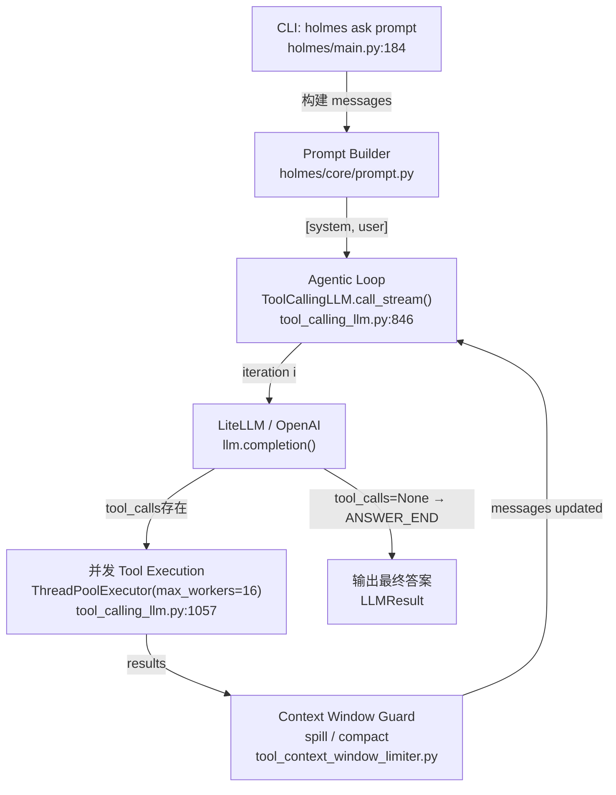

---

## 2. 入口：`ask()` 函数做了什么

**文件**：`holmes/main.py:184`

### 2.1 关键参数

```python
@app.command()
def ask(
    prompt: Optional[str],
    interactive: bool = True,          # 交互模式 vs 单次问答
    fast_mode: bool = False,           # 跳过 TodoWrite planning
    bash_always_deny: bool = False,    # bash 工具全拒绝
    bash_always_allow: bool = False,   # bash 工具无需审批
    max_steps: int = 100,              # agentic loop 最大迭代次数
    ...
)
```

`fast_mode` 是一个值得关注的设计点（`main.py:332-336`）：

```python
if fast_mode:
    prompt_component_overrides = {
        PromptComponent.TODOWRITE_INSTRUCTIONS: False,  # 关闭任务分解规划
        PromptComponent.TODOWRITE_REMINDER:     False,
    }
```

**工程意义**：TodoWrite 是让 LLM 先做子问题分解再执行的 planning 机制，禁用它可以节省 1-2 轮 LLM 调用，适合简单问题或低延迟场景。代价是复杂问题的分析质量下降。

### 2.2 执行路径分叉

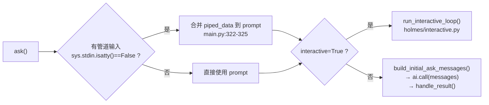

**两条路径的关键区别**：

| 模式 | 对话历史 | 入口函数 |
|------|---------|---------|
| 非交互 | 单轮，call 一次就结束 | `ai.call(messages)` |
| 交互式 | 多轮，messages 持续追加 | `run_interactive_loop()` |

---

## 3. Prompt 构建系统

**文件**：`holmes/core/prompt.py`

### 3.1 架构

System Prompt 和 User Prompt 是分开构建的，通过 `build_prompts()` 统一编排：

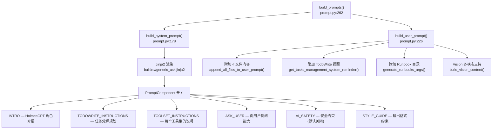

### 3.2 PromptComponent 开关机制

```python
# prompt.py:98-115
def is_component_enabled(component, overrides=None) -> bool:
    env_allowed = is_prompt_allowed_by_env(component)   # ENABLED_PROMPTS 环境变量
    if not env_allowed:
        return False                   # 环境变量优先级最高，不可覆盖
    if overrides and component in overrides:
        return overrides[component]    # API 层 override 次之
    return component not in DISABLED_BY_DEFAULT  # 默认值兜底
```

**优先级链**：`env var > API override > hardcoded default`

这是一个干净的策略模式。`AI_SAFETY` 默认关闭（`DISABLED_BY_DEFAULT`），需要 Robusta 平台层主动启用——说明这是为 SaaS 场景设计的隔离开关。

### 3.3 TodoWrite 是怎么运作的

`get_tasks_management_system_reminder()`（`prompt.py:138`）向 user prompt 末尾注入了一段 system-reminder：

```
IMPORTANT: You have access to the TodoWrite tool.
1. FIRST: Ask yourself which sub problems you need to solve
2. AFTER EVERY TOOL CALL: If required, update the TodoList
FAILURE TO UPDATE TodoList = INCOMPLETE INVESTIGATION
```

**本质**：这是一个 **in-context planning 机制**，通过 prompt engineering 强制 LLM 执行 Plan-Execute 模式，而不依赖外部 orchestrator。简单、可控、zero-overhead。

---

## 4. Agentic Loop 核心：`call_stream()` 深度解析

**文件**：`holmes/core/tool_calling_llm.py:846`

### 4.1 整体状态机

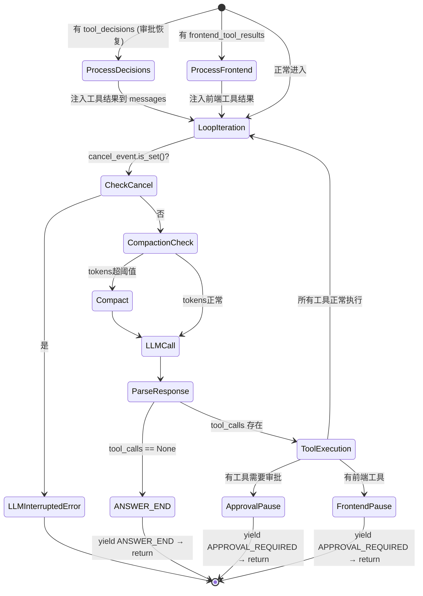

### 4.2 核心迭代循环

```python
# tool_calling_llm.py:905
while i < max_steps:
    if cancel_event and cancel_event.is_set():
        raise LLMInterruptedError()          # ESC 键中断

    i += 1
    tools = None if i == max_steps else tools  # 最后一步强制不提供工具，逼 LLM 给答案

    # 1. 上下文窗口检查 + 压缩
    compaction_start_event = check_compaction_needed(self.llm, messages, tools)
    if compaction_start_event:
        yield compaction_start_event          # 提前通知前端"正在压缩"
    limit_result = compact_if_necessary(llm, messages, tools)

    # 2. LLM 调用（非流式，整轮输出）
    full_response = self.llm.completion(
        messages=parse_messages_tags(messages),
        tools=tools,
        tool_choice="auto",
        stream=False,                         # 注意：对 LLM 不流式，对调用方用生成器流式
    )

    # 3. 解析响应
    tools_to_call = response_message.tool_calls
    if not tools_to_call:
        yield StreamMessage(event=ANSWER_END, ...)   # 终止循环
        return

    # 4. 并发执行工具（见下节）
    with ThreadPoolExecutor(max_workers=16) as executor:
        ...
```

**关键设计决策**：`stream=False`（`tool_calling_llm.py:968`）

这里有个反直觉的设计：对 LLM 的调用是**非流式**的（等待完整响应），但 `call_stream()` 自身是一个**生成器**（对调用方表现为流式）。

**为什么这样设计**？

- LLM 流式输出时，tool_calls 要等整个 response 完成才能知道调用哪些工具
- 每轮迭代结束就 yield 一批事件，调用方可以实时展示进度
- 避免了"拿到 token 1 但不知道要调哪个工具"的尴尬状态

### 4.3 并发 Tool 执行

```python
# tool_calling_llm.py:1057-1076
with concurrent.futures.ThreadPoolExecutor(max_workers=16) as executor:
    futures = []
    for tool_index, t in enumerate(tools_to_call, 1):
        future = executor.submit(
            self._invoke_llm_tool_call,
            tool_to_call=t,
            previous_tool_calls=tool_calls,   # 用于重复检测
            ...
        )
        futures.append(future)
        yield StreamMessage(event=START_TOOL, data={"tool_name": t.function.name})

    for future in concurrent.futures.as_completed(futures):  # 谁先完成谁先 yield
        tool_call_result = future.result()
        ...
```

**并发模型**：`ThreadPoolExecutor`，每批 tool_calls 最多 16 个线程并发。

```mermaid
sequenceDiagram
    participant LOOP as call_stream()
    participant TPE as ThreadPoolExecutor
    participant T1 as Tool-1 kubectl_get_pods
    participant T2 as Tool-2 kubectl_logs
    participant T3 as Tool-3 prometheus_query

    LOOP->>TPE: submit(tool1)
    LOOP-->>Client: yield START_TOOL(tool1)
    LOOP->>TPE: submit(tool2)
    LOOP-->>Client: yield START_TOOL(tool2)
    LOOP->>TPE: submit(tool3)
    LOOP-->>Client: yield START_TOOL(tool3)

    par 并发执行
        TPE->>T1: invoke
        TPE->>T2: invoke
        TPE->>T3: invoke
    end

    T2-->>TPE: result (最先完成)
    TPE-->>LOOP: future.result()
    LOOP-->>Client: yield TOOL_RESULT(tool2)

    T1-->>TPE: result
    TPE-->>LOOP: future.result()
    LOOP-->>Client: yield TOOL_RESULT(tool1)

    T3-->>TPE: result
    TPE-->>LOOP: future.result()
    LOOP-->>Client: yield TOOL_RESULT(tool3)

    LOOP->>LOOP: messages.append(all_tool_results)
    LOOP->>LOOP: 进入下一次 LLM 迭代
```

**工程权衡**：

- 优点：多工具并发，I/O 密集型工具（kubectl、HTTP API）天然适合
- 缺点：工具之间有数据依赖时，并发是错的（LLM 靠多轮 loop 解决此问题）
- `max_workers=16` 是硬编码的魔数，没有暴露配置

---

## 5. Tool 执行层

### 5.1 调用链路

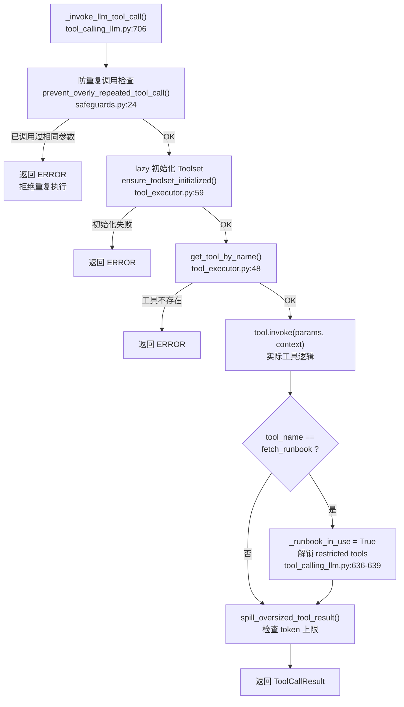

### 5.2 ToolExecutor 的数据结构

**文件**：`holmes/core/tools_utils/tool_executor.py`

```python
class ToolExecutor:
    toolsets: List[Toolset]               # 所有 toolset（含未启用的）
    enabled_toolsets: list[Toolset]       # 仅启用的 toolset
    tools_by_name: dict[str, Tool]        # tool_name → Tool 对象 (O(1) 查找)
    _tool_to_toolset: dict[str, Toolset]  # tool_name → 所属 Toolset
```

初始化时会做去重处理（`tool_executor.py:28-46`）——同名 toolset 或同名 tool，后者覆盖前者，**这是自定义 toolset 覆盖内置 toolset 的机制**。

### 5.3 安全防护：防重复 Tool 调用

**文件**：`holmes/core/safeguards.py:24`

```python
def prevent_overly_repeated_tool_call(tool_name, tool_params, tool_calls):
    if _has_previous_exact_same_tool_call(tool_name, tool_params, tool_calls):
        return StructuredToolResult(
            status=ERROR,
            error="Refusing to run: already called with exact same parameters. Move on."
        )
    return None
```

**问题**：这个检查是基于 `exact match`（`tool_params == previous_params`）。

- 如果 LLM 调用 `kubectl_get_pods(namespace="default")` 两次，第二次会被拦截 ✅
- 如果 LLM 调用 `kubectl_get_pods(namespace="kube-system")` 然后又调 `kubectl_get_pods(namespace="default")`，不会拦截 ✅（不同参数）
- 这个检查在 compaction 后可能被重置（`tool_calling_llm.py:954-957`）

### 5.4 Restricted Tools 机制

```python
# tool_calling_llm.py:422-430
def _should_include_restricted_tools(self) -> bool:
    return self._runbook_in_use

def _get_tools(self) -> list:
    return self.tool_executor.get_all_tools_openai_format(
        include_restricted=self._should_include_restricted_tools(),
    )
```

**设计逻辑**：某些危险工具（如写操作、执行命令）被标记为 `restricted`。默认不暴露给 LLM，只有当 LLM 成功调用 `fetch_runbook` 工具后，`_runbook_in_use` 被设为 True，下一轮迭代开始才会把 restricted tools 加入工具列表（`tool_calling_llm.py:1197-1203`）。

**这是一个基于运行时状态的动态工具授权机制**——Runbook 充当了"授权令牌"的角色。

---

## 6. Context Window 管理：两层防御

HolmesGPT 有两层独立的 context window 管理机制，解决不同层次的溢出问题：

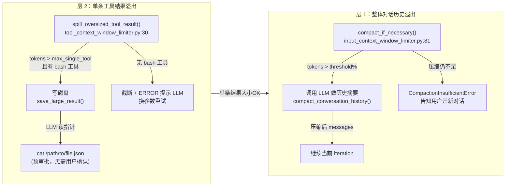

### 6.1 层 1：对话历史压缩（Compaction）

**文件**：`holmes/core/truncation/input_context_window_limiter.py:81`

触发条件（`line:92-94`）：

```python
if (initial_tokens.total_tokens + maximum_output_token) > (
    max_context_size * get_context_window_compaction_threshold_pct() / 100
):
```

**工程细节**：

- 压缩前先 yield `COMPACTION_START` 事件，让前端可以提示用户"正在压缩历史"（`tool_calling_llm.py:916-917`）
- 压缩由另一次 LLM 调用完成（用小模型 summarize 历史），本质是 **meta-reasoning**
- 压缩后 token 数如果没有减少，抛 `CompactionInsufficientError`，不静默失败

### 6.2 层 2：单条工具结果溢出（Spill to Disk）

**文件**：`holmes/core/tools_utils/tool_context_window_limiter.py:30`

当单条工具结果超过 `max_token_count_for_single_tool` 时：

1. **有 bash 工具时**：写磁盘，给 LLM 返回文件路径和预览，引导 LLM 用 `cat` 读取（`line:93-116`）
2. **无 bash 工具时**：直接截断，返回 ERROR，提示 LLM 换更精确的参数重试（`line:127-131`）

**妙处在于**：写磁盘的文件路径是预审批的（`line:97`：`pre-approved, no user approval needed`），避免了 LLM 为了读自己刚写的文件还要再触发审批流程。

---

## 7. 审批机制：人在回路（Human-in-the-Loop）

### 7.1 三种工具执行状态

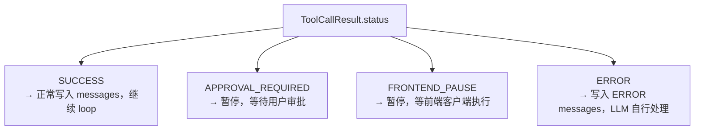

### 7.2 审批流程（CLI 模式 vs Server 模式）

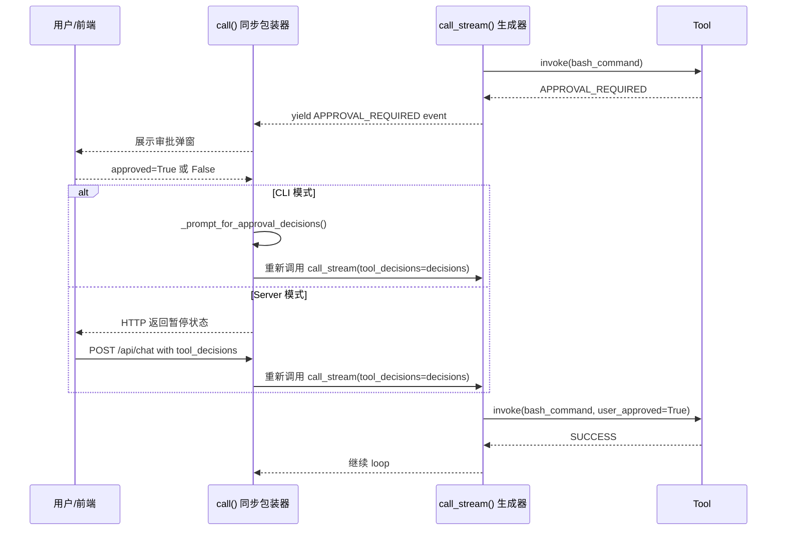

**关键代码**（`tool_calling_llm.py:451-534`）：

```python
# call() 是 call_stream() 的同步包装器
while True:
    stream = self.call_stream(msgs=messages, tool_decisions=tool_decisions, ...)

    for event in stream:
        if event.event == APPROVAL_REQUIRED:
            terminal_event = APPROVAL_REQUIRED
            break
        if event.event == ANSWER_END:
            terminal_event = ANSWER_END
            break

    if terminal_event == APPROVAL_REQUIRED:
        # CLI 模式：同步等待用户输入
        messages = terminal_data["messages"]
        tool_decisions = self._prompt_for_approval_decisions(
            terminal_data["pending_approvals"],
            approval_callback,   # CLI 的交互审批回调
        )
        continue   # 带着 decisions 重新进入 call_stream()

    if terminal_event == ANSWER_END:
        return LLMResult(...)
```

**会话前缀审批**（`tool_calling_llm.py:101-141`）：

用户可以选择 "Yes, and don't ask again for this prefix"，prefix 被存入对话历史的 `tool_call_metadata`。下次同前缀命令无需再次审批——这是跨 loop 迭代的**隐式状态传递**。

---

## 8. `call()` vs `call_stream()`：同步与流式的关系

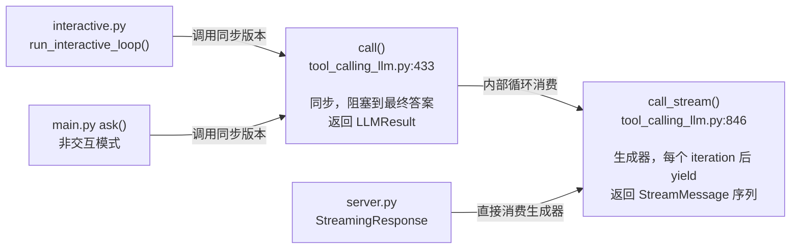

**`call()` 的设计本质**（`tool_calling_llm.py:443-444`）：

```
Synchronous wrapper around call_stream(). Drains the generator and reconstructs an LLMResult.
```

这是一个干净的 **Adapter 模式**：

- `call_stream()` 是核心实现，流式友好
- `call()` 是为非流式调用者提供的包装器（CLI、测试代码）
- Server 模式直接使用 `call_stream()` 喂给 `StreamingResponse`

---

## 9. 完整数据流

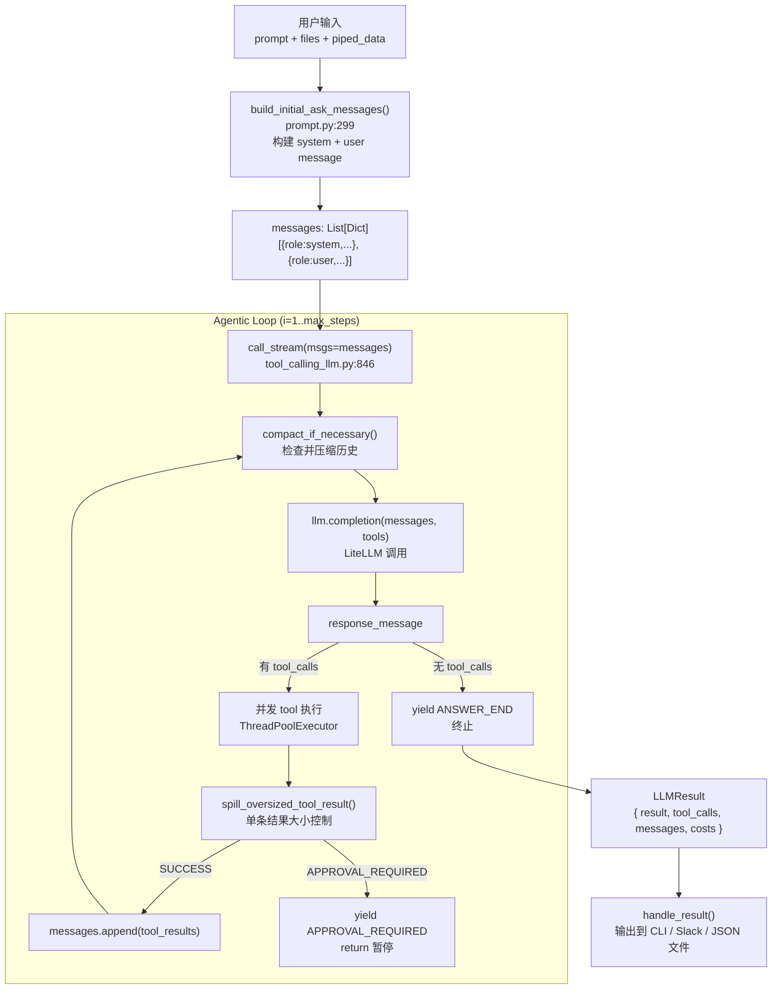

---

## 10. 关键工程问题与分析

### 10.1 max_steps=100 是否合理？

**代码位置**：`main.py:100-104`，默认值 100。

100 步意味着最多 100 次 LLM 调用 + 100 批工具执行。对于复杂的 K8s 故障排查，这通常足够。但成本风险是真实的：

```
最坏情况: 100次 LLM 调用 × 1000 tokens/次 × $3/1M tokens = $0.30/请求
```

最后一步的设计很妙（`tool_calling_llm.py:912`）：

```python
tools = None if i == max_steps else tools
```

强制最后一步不提供工具，LLM 只能生成文本答案，避免了在 max_steps 边界出现"要求工具调用但被拒绝"的错误状态。

### 10.2 工具并发执行的隐患

并发执行所有 tool_calls 是正确的 I/O 优化，但有一个潜在问题：

**工具之间有隐式依赖时**，比如 LLM 在同一批 tool_calls 中发出：

1. `kubectl_get_pods(namespace="default")`
2. `kubectl_logs(pod_name=<来自步骤1的结果>)`

步骤 2 的参数此时是错误的（因为步骤 1 还没执行完）。

**HolmesGPT 的应对**：这种情况会让步骤 2 返回 ERROR，LLM 在下一轮 loop 中看到 ERROR 后会重新规划。**本质是用多轮循环替代了显式的依赖管理**，用正确性换简单性。

### 10.3 为什么不用 async/await？

工具执行用了 `ThreadPoolExecutor` 而非 `asyncio`，原因：

1. 工具大量使用 `subprocess`（kubectl）和同步 HTTP 库（`requests`）
2. 改为 async 需要重写所有工具实现
3. 线程模型在 GIL 下对 I/O 密集型工作仍然有效

对于未来优化方向，可以考虑 `asyncio.to_thread()` 包装现有同步工具，保持兼容性的同时获得更好的并发原语。

### 10.4 Compaction 的 meta-cost 问题

Compaction 本身需要一次 LLM 调用来 summarize 历史（`compact_conversation_history()`）。这意味着：

- 触发 compaction 时，会产生额外的 LLM 费用
- `stats += compaction_usage` 被正确追踪了（`tool_calling_llm.py:944-951`）
- 但如果 compaction 触发频繁（比如工具结果很大），meta-cost 可能不可忽视

**工程建议**：对于大型工具结果，优先通过 spill-to-disk 减少单条大小，而不是依赖 compaction。

---

## 11. 完整架构汇总

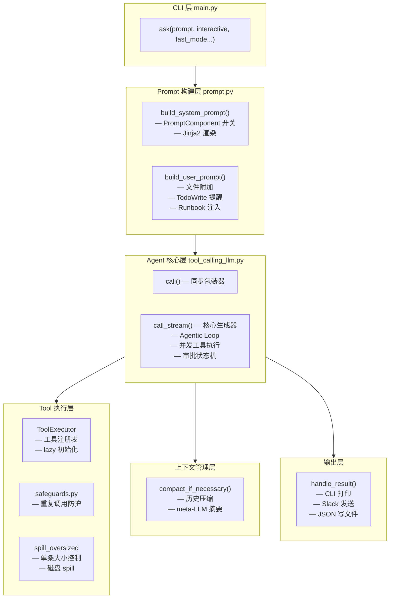

---

## 附录：关键源码位置索引

| 概念 | 文件 | 行号 |
|------|------|------|
| CLI 入口 `ask()` | `holmes/main.py` | 184 |
| fast_mode 开关 | `holmes/main.py` | 332-336 |
| System Prompt 构建 | `holmes/core/prompt.py` | 178 |
| User Prompt 构建 | `holmes/core/prompt.py` | 226 |
| PromptComponent 优先级 | `holmes/core/prompt.py` | 98 |
| TodoWrite 提醒注入 | `holmes/core/prompt.py` | 138 |
| Agentic Loop 主循环 | `holmes/core/tool_calling_llm.py` | 905 |
| 并发 Tool 执行 | `holmes/core/tool_calling_llm.py` | 1057 |
| 审批流程入口 | `holmes/core/tool_calling_llm.py` | 511 |
| 防重复调用 | `holmes/core/safeguards.py` | 24 |
| 单条结果大小控制 | `holmes/core/tools_utils/tool_context_window_limiter.py` | 30 |
| 历史压缩检查 | `holmes/core/truncation/input_context_window_limiter.py` | 26 |
| 历史压缩执行 | `holmes/core/truncation/input_context_window_limiter.py` | 81 |
| Restricted Tools 解锁 | `holmes/core/tool_calling_llm.py` | 636 |
| ToolExecutor 初始化 | `holmes/core/tools_utils/tool_executor.py` | 16 |
| Lazy Toolset 初始化 | `holmes/core/tools_utils/tool_executor.py` | 59 |
